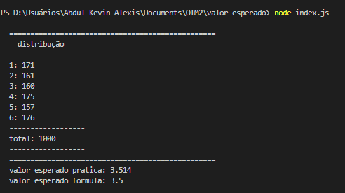
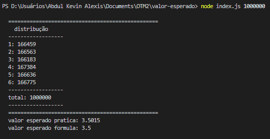
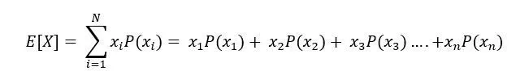

# Trabalho Final / Otimização 2

Esse trabalho é uma experiência realizada como trabalho final da disciplina OTIMIZAÇÃO 2. A experiência consiste em verificar se a formula matematica do valor esperado é igual ao valor esperado se fizermos na prática. Será usado um dado eletrônico.

=\sum_{i}^{}&space;X_i&space;P(X_i))


## Referência

 - [Esperança matemática](https://pt.economy-pedia.com/11038249-mathematical-hope)
 - [Material de aula disponibilizado pelo professor](https://sig.cefetmg.br/sigaa/portais/discente/discente.jsf#)

## Orientação para rodar o código

#### Requisitos
- Node.js


#### Execução 1
```javascript
 ~> node index.js
```
por padrão, o numero experimento é 1000.



#### Execução 2
```javascript
 ~> node index.js [numero de experimento]
```


#### Video

[](http://www.youtube.com/watch?v=NW-hsrIiqYE "Video de Apresentação")


## Autores

- [Abdul Kevin Alexis](https://github.com/lildiop2)

## Professores

- [Elizabeth Wanner](efwanner@cefetmg.br)

